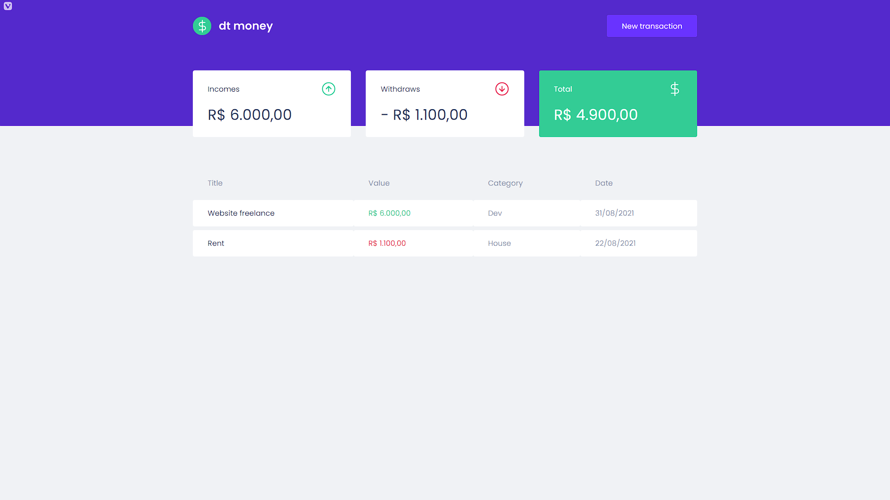
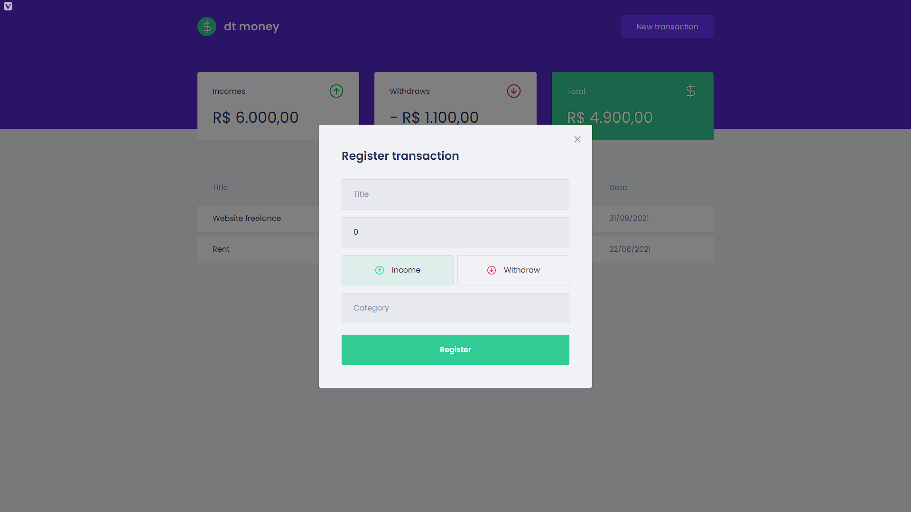

<div align="center" id="top">
  
</div>

<hr/>
<br>

## About

This applications is an personal finance manager.

## Screenshots

<div align="center" id="top">
  
</div>
<br/>
<br/>
<div align="center" id="top">
  
</div>

## Features

- Personal finance table with name, amount, category and date.
- Summary cards with incomes, withdrawns and total.
- Modal to create new transactions.

## Technologies

The following tools were used in this project:

- [React](https://pt-br.reactjs.org/)
- [TypeScript](https://www.typescriptlang.org/)
- [MirageJS](https://miragejs.com/)
- [Polished](https://polished.js.org/)
- [Axios](https://github.com/axios/axios)
- [Styled Componensts](https://styled-components.com/)

## Requirements

Before starting 🏁, you need to have [Git](https://git-scm.com) and [Node](https://nodejs.org/en/) installed.

## Starting

```bash
# Clone this project
$ git clone https://github.com/yuribmontez/dtmoney

# Access
$ cd dtmoney

# Install dependencies
$ yarn

# Run the project
$ yarn start

# The server will initialize in the <http://localhost:3000>
```
<hr /> 

Made with 💜
